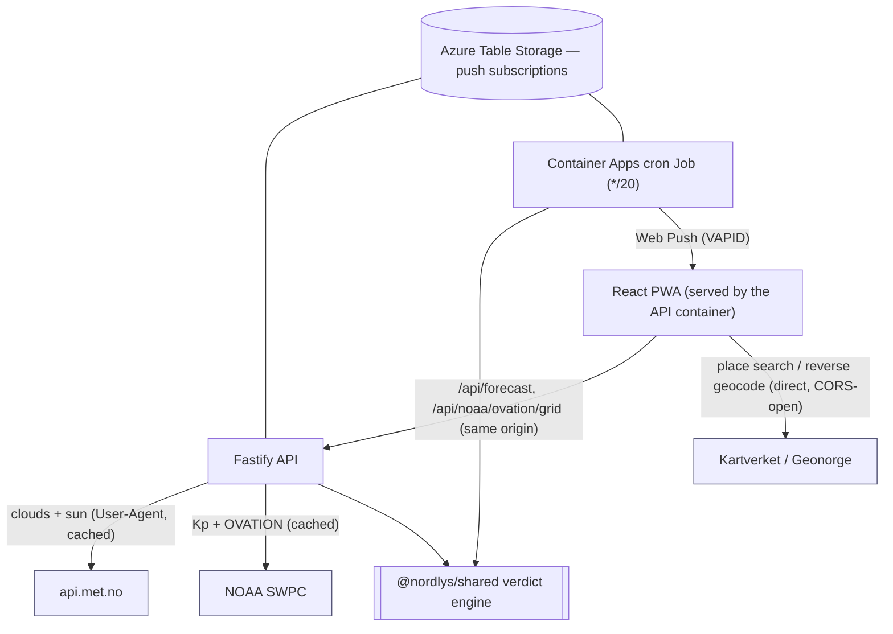

# Architecture

## Overview

A small, viral-friendly web app that gives a **GO / MAYBE / NO** answer to
"can I see the aurora tonight from my location?". It composes three open data
sources and renders a one-screen, mobile-first verdict + a 3-day timeline + a map.

## Why these choices

### Single image, single Container App
The Fastify server serves the **built SPA** (`@fastify/static`) and the API from the
**same origin**. Benefits: no web↔api CORS, one thing to deploy, cheapest hosting.
The web build is copied into the image; the server resolves it from `WEB_DIST_PATH`
(set to `/app/apps/web/dist` in the container) or `../../web/dist` in local dev.

### Shared verdict engine (`packages/shared`)
The GO/MAYBE/NO logic is a **pure, deterministic** function in `@nordlys/shared`.
Both the **browser** (via `/api/forecast`, which calls it server-side) and the
**notification job** use the exact same code, so a user's on-screen verdict and the
push they receive can never disagree. See [verdict-engine.md](./verdict-engine.md).

### `tsx` runtime (no compile step) for the API
The API runs with `tsx` in dev **and** production (`tsx src/server.ts`). This avoids
ESM `.js`-extension friction and lets Fastify **auto-load** route plugins from
`src/routes/*.ts` at runtime (a bundler would not pick those up). Trade-off: a tiny
startup cost, negligible here. Consequence: **use extensionless relative imports**
everywhere in `apps/api` (and the rest of the repo).

### Scale-to-zero + a separate cron Job
The Container App uses `minReplicas=0` (≈ €0 when idle). But push notifications need a
periodic evaluator — which can't run if the app is asleep. Solution: a **Container Apps
Job** (`triggerType: Schedule`, cron `*/20 * * * *`) runs the **same image** with a
`job` command, evaluates every subscription, and exits. The app and job share state via
**Azure Table Storage**. Set `minReplicas=1` to keep a warm instance during aurora season.

## Request flow: "what's the verdict for Tromsø?"

1. User selects a location (geolocation, Kartverket search, or a preset chip).
2. The web app calls `GET /api/forecast?lat&lon&name` (same origin).
3. The API (cached):
   - fetches **MET** `locationforecast` → hourly `cloud_area_fraction`,
   - fetches **NOAA** Kp forecast (3-hourly) + samples the **OVATION** oval at the point,
   - runs `computeVerdict(...)` from `@nordlys/shared`.
4. Returns `{ location, inputs: { kpForecast, cloudForecast, ovation }, verdict }`.
5. The UI renders the verdict gauge, the 3-day timeline (from `inputs`), and the map
   (aurora oval via `GET /api/noaa/ovation/grid`).

## State & data

- **No user database for the core app** — it's effectively stateless. The only
  persisted state is **push subscriptions** (endpoint + keys + coarse location + prefs),
  needed for notifications. Local dev stores them in a JSON file; production uses Azure
  Table Storage. Both implement the same `SubscriptionStore` interface.
- **Client-only personal data:** selected location, language, and consent live in
  `localStorage`. Geolocation never leaves the device except when the user subscribes to
  push (then a **coarse**, rounded lat/lon is stored).

## Build/runtime dependency order

`@nordlys/shared` must be **built** (`tsc` → `dist/`) before `apps/api` (imports its dist
at runtime via `tsx`) and before `apps/web` typecheck/build resolve `@nordlys/shared`.
`pnpm -r build` respects the topological order; the Dockerfile builds shared, then web.
