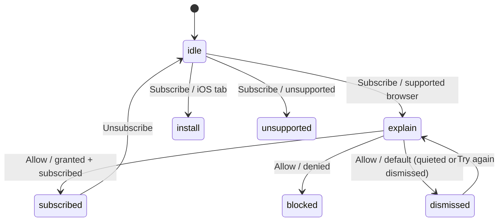

# Push notifications

`Nordlys i natt?` supports optional Web Push alerts for users who want a nudge when their saved
location has a **GO** aurora verdict. Push is intentionally conservative: the browser opt-in is a
soft-prompt (double opt-in), and the backend only sends during useful windows.

## Soft-prompt design

The notify UI lives in `apps/web/src/components/NotifyButton.tsx`. It must not open the browser's
native permission dialog on first render. Instead, every platform starts with the same compact,
non-native UI:

- a very short sentence explaining the feature;
- a `Subscribe` button.

Only after the user clicks `Subscribe` does the UI branch:

| Branch | Condition | UI | Native permission? |
|---|---|---|---|
| Explain | Push is supported in the current browsing context | In-UI explanation: the native dialog is coming, expected cadence, and unsubscribe path | Yes, but only from the next `Allow notifications` button |
| Install | iOS/iPadOS Safari or Chrome tab | Add-to-Home-Screen guidance because iOS Web Push requires an installed PWA | No |
| Unsupported | Browser/context cannot use Web Push | Short “not supported” message | No |

The `Allow notifications` button in the explain step is the **only** caller of
`Notification.requestPermission()` and `subscribeToPush()`. That call must remain inside the explicit
button handler so the browser sees a real user gesture and a clear user intent.

After a successful subscription, the UI shows the notification cadence and an `Unsubscribe` button.

`Notification.requestPermission()` has **three** outcomes, and the app treats them differently:

- `granted` → subscribe and show the subscribed state.
- `denied` (the user actively blocked) → the **blocked** state with re-enable guidance.
- `default` → the request was **dismissed or quietly held** by the browser (Edge/Chrome quiet UI). This
  is **not** a hard block, so the app shows a separate “permission wasn’t granted” state with a
  **Try again** button and a pointer to Site settings — never the misleading “blocked” message.

> Pitfall (fixed June 2026): treating a `default` result as `denied` makes a quietly-held Edge request
> look permanently blocked, and the blocked hint then points at a **Notifications** row that the browser
> does not show until a decision exists (see below).



## Why a soft prompt?

Microsoft Edge and other Chromium browsers protect users from notification spam. A site that asks too
early or too often can have its permission request quieted or blocked before the user ever sees the
normal prompt.

Key Edge/Chromium findings:

- **Quiet notification requests** — the browser may show a small bell/lock indicator in the address
  bar instead of a modal popup, or suppress the prompt. This can be auto-enabled after repeated
  dismissals/denials and may be enabled by default in managed or privacy-focused profiles.
- **Abusive / crowd-deny lists** — Chromium Safe Browsing can mark notification-abusive sites, or
  sites with very low accept rates. Those sites' requests can be auto-blocked for everyone.
- **Low engagement / no user gesture** — prompts not tied to a clear user gesture, or prompts from
  low-engagement sites, are more likely to be quieted or denied.
- **History of denials & profile settings** — prior denials for this origin, a global block setting,
  or a “quiet requests” profile preference can cause auto-deny.

### Mitigation in this app

The app **never** calls `Notification.requestPermission()` or `subscribeToPush()` on load. It calls
them only after the user first chooses `Subscribe`, reads the in-UI explanation, and clicks
`Allow notifications`. This is the key technical decision: it maximizes the genuine user-gesture and
engagement signal, avoids surprising prompts, and reduces the chance that Edge/Chromium quiet-request
or abusive-notification heuristics classify the site negatively.

### Re-enabling notifications (Edge & Chrome)

**Important:** the **Notifications** row does **not** appear in the address-bar lock/site flyout until
the origin has an actual notification decision (granted or denied). Until then — including when a
request was only *quieted* (`default`) — there is no Notifications toggle there (the flyout still shows
Location, cookies, etc., but no Notifications). The reliable path is the full **Site settings** page:

- **Microsoft Edge**: lock icon → **Site settings** → **Notifications** → **Allow**, then reload; or
  open `edge://settings/content/notifications`, turn off **Quiet notification requests** if needed, and
  add the origin under **Allow**.
- **Google Chrome**: lock/tune icon → **Site settings** → **Notifications** → **Allow**, then reload;
  or open `chrome://settings/content/notifications` and add the origin under **Allow**.

The app's `dismissed` and `blocked` hints surface the short version (look for a bell icon in the
address bar, or open **Site settings → Notifications → Allow**, then reload / try again).

## iOS and Safari constraints

On iOS/iPadOS, Web Push works only for an installed Home Screen PWA on iOS/iPadOS 16.4 or newer. In a
normal Safari or Chrome tab, `window.Notification` and/or `window.PushManager` are unavailable, so
`isPushSupported()` in `apps/web/src/api/push.ts` returns `false`. The notify UI should therefore send
iOS tab users to the Add-to-Home-Screen step instead of showing the native permission flow.

## Backend cadence

Notification evaluation is implemented in `apps/api/src/scheduler/evaluate.ts` and runs from the
Container Apps cron Job. The infrastructure default schedule is every 20 minutes:

```text
*/20 * * * *
```

For each stored subscription, the job:

1. builds a fresh forecast with the shared verdict engine;
2. sends a push only when the current verdict is `GO`;
3. de-duplicates with `shouldNotify()` to at most once per 6 hours while the verdict remains `GO`;
4. suppresses sends during Europe/Oslo quiet hours `[start, end)`, default `02:00–06:00`, via
   `config.quietHours` (`QUIET_HOURS_START` / `QUIET_HOURS_END`) and `isInQuietWindow()`;
5. prunes expired subscriptions when the push service reports `410` or `404`.

Quiet hours are start-inclusive and end-exclusive. Setting start and end to the same value disables
the quiet window.

## Subscription lifecycle and VAPID

Frontend subscription helpers live in `apps/web/src/api/push.ts`:

- `subscribeToPush(location, lang)` waits for the service worker, calls `pushManager.subscribe()`,
  `POST`s `{ subscription, location, lang }` to `/api/subscriptions`, and stores the returned id in
  `localStorage['nordlys.push.id']`.
- `unsubscribeFromPush()` deletes `/api/subscriptions/:id`, unsubscribes the active
  `PushSubscription`, and removes the local id.
- The VAPID public key comes from `import.meta.env.VITE_VAPID_PUBLIC_KEY` when present, otherwise from
  `GET /api/push/public-key`.

The service worker push handlers live in `apps/web/public/push-sw.js`. Vite PWA generation merges
them into the generated service worker with `workbox.importScripts` in `apps/web/vite.config.ts`.
The push payload contract is `{ title, body, url }`.

## Testing

Hermetic Playwright coverage lives in `apps/web/tests/push.spec.ts`. The tests assert the core safety
properties:

- no subscription `POST` on initial page load;
- no `Notification.requestPermission()` on initial page load;
- no `PushManager.subscribe()` on initial page load;
- a positive control where a click triggers permission and subscription;
- a `default` (quieted/dismissed) result shows the actionable “try again” guidance, **not** the blocked
  state, and does not subscribe.

Run the web push tests with:

```bash
pnpm --filter @nordlys/web test:e2e
```
